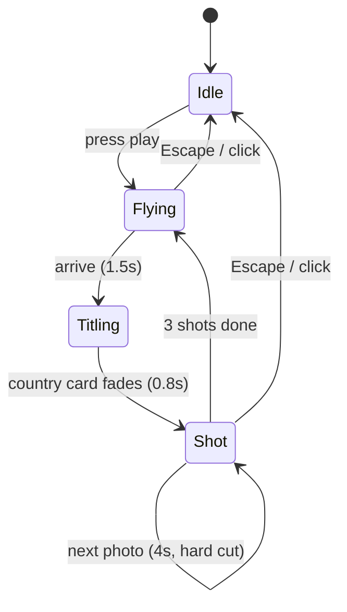

# Atlas — project plan

> **"Atlas" is a placeholder name** — a book of maps, and the Titan holding up the
> world. Nothing technical depends on it. Rename freely; `nature-gallery` just won't
> fit the project anymore.

A 3D globe you spin. Click a country, get a photo slider. Hit play and the camera flies
country to country showing shots like a documentary.

This replaces the nature gallery — same project, more advanced version. The cinema
viewer already built (clip-path unfold, Ken Burns, letterbox, grain, title cards)
becomes the playback layer for everything here.

---

## 1. Photo sources — the comparison you asked for

| | **Pexels** | **Unsplash** | **Wikimedia Commons** |
| --- | --- | --- | --- |
| API key | Instant, no review | Instant, but **approval needed** to leave dev mode | None |
| Rate limit | **200/hr, 20k/mo** | 50/hr until approved | No hard cap (be polite, set a real User-Agent) |
| Caching | **Explicitly encouraged** — they suggest caching responses ~24h | Must hotlink their CDN; don't self-host | Free to cache or self-host |
| Attribution | Required: link to Pexels + photographer | Required: photographer + Unsplash, with `utm_source` params | Required per-file, varies by licence (PD / CC BY / CC BY-SA) |
| Licence | One simple licence, commercial OK | One simple licence | **Mixed** — share-alike on some files |
| Look | Good, slightly mixed | **Most consistent** | Inconsistent — tourist snaps next to pro work |
| Coverage of obscure countries | Thin | Thin | **Excellent — every country has files** |

**Verdict: Unsplash primary. Pexels as backup, Commons for the obscure ones.**

The rate-limit column is the one that looks decisive and isn't. Because the API is
called **once at build time** (§4) for ~40 countries, the whole seeding run is roughly
40 requests — comfortably inside Unsplash's 50/hr dev cap. Production approval exists to
raise a ceiling this project never reaches, so it isn't friction we'll actually feel.

With that removed, Unsplash wins on what's left:

- **Consistency of look.** For a visual showpiece the photos *are* the product, and 40
  countries of mixed-quality stock sitting side by side is the failure mode.
- **Already proven in this repo.** The nature gallery hotlinks Unsplash with
  `w=1200&q=85` today — same CDN, same resize trick, no new unknowns.
- Attribution is required either way; Unsplash just also wants `utm_source` /
  `utm_medium` on the photographer link. One line in a template.

Pexels remains the backup for countries where Unsplash's results are thin (its licence
is the most permissive of the three and the key is instant), and Commons covers the
countries neither stock site serves. Because every photo carries a `source` label,
mixing sources is free and switching primary later is ~30 minutes.

**Start with Pexels only. No adapter layer.**

Writing a plug-in system for sources we aren't using yet is work with no payoff — we
write the Pexels fetch directly and plainly. The only forward-looking thing we keep is a
`"source": "pexels"` field on each photo in the JSON. That's a label, not an
abstraction, and it means adding Commons or your own photos later doesn't require
rewriting data that already exists.

### Your own photos, later

You said you've been across the globe and have some photos. Don't treat this as
either/or — later, your own shots go into the same JSON with `source: "own"`, and the UI
gives them a small **"shot by Nils"** mark.

That's the honest version and also the better CV story: the globe is the engineering,
and a handful of countries carry your own photography. What we avoid is stock photos
implicitly captioned as your travels — that's the one thing that would undercut the
piece if someone looked closely. Marked sources make the whole thing truthful with zero
loss of cool.

Your photos need lat/lng; for those we do need the EXIF step
([exifr](https://github.com/MikeKovarik/exifr)) plus a manual placement fallback, since
Google Photos exports and anything sent through chat apps often have GPS stripped. That
work only happens when you actually add your own photos — it isn't a Phase 1 blocker.

---

## 2. Scope

193 UN member states is right (195 with Vatican + Palestine). At ~5 photos each that's
~1000 photos, and auto-searching `"Chad landscape"` returns a stock photo of a flag.

**Target 40 curated countries first.** The globe looks identical, the data model
doesn't care, and adding country 41 is one line of config. Completeness is a
nice-to-have; a broken-looking country is a real cost.

---

## 3. Stack

| Piece | Pick | Why |
| --- | --- | --- |
| Globe | **[globe.gl](https://github.com/vasturiano/globe.gl)** (MIT, vanilla, wraps Three.js) | Country polygons, `onPolygonClick`, `pointOfView(coords, ms)` camera flights. That last method *is* the world tour. |
| Country shapes | **[world-atlas](https://github.com/topojson/world-atlas)** TopoJSON, Natural Earth 110m | ~180 low-poly countries, small file, ISO codes included |
| Bundler | **Vite** | npm-install the above; existing vanilla code ports over unchanged |
| Photo data | Generated `photos.json` | The only data the site loads at runtime |

Not using: React/Next (one canvas and one overlay — nothing needs a component tree),
Mapbox (keys, billing, overkill at country level),
[COBE](https://shud.in/thoughts/cobe) (lovely 5kB globe, but decorative dots with no
clickable countries — the whole feature).

Reference: [github-globe](https://github.com/janarosmonaliev/github-globe) for the
glow/atmosphere look, and globe.gl's
[choropleth-countries example](https://github.com/vasturiano/react-globe.gl/blob/master/example/choropleth-countries/index.html).

---

## 4. Data

### The site never calls an API

Worth being explicit, because "fetch" is a misleading word here. The API is called
**once, on your machine, during development** — never by a visitor.

```
YOU, ONCE:   npm run fetch  →  calls Pexels  →  writes photos.json  →  you commit it
VISITOR:     opens site     →  reads photos.json  →  done
```

Consequences of doing it this way:

- **Same photos every time**, for everyone, forever — until you deliberately re-run the
  script. The photo list is as fixed as if you'd typed it by hand.
- **No API key in the browser.** It lives in a git-ignored `.env` on your machine only.
- **No rate limits, no latency, no outage risk** from someone else's API. If Pexels goes
  down, your site doesn't notice.
- The script is just a labour-saver — it writes a list of URLs so you don't copy-paste a
  thousand of them by hand. That's its entire job.

The only runtime dependency is Pexels' image CDN serving the photos themselves, same as
your current gallery hotlinks Unsplash images today.

### Files

`src/data/countries.config.json` — hand-edited, the input:

```json
{ "ISL": { "query": "Iceland landscape", "keep": ["8123", "9910"] } }
```

Once `keep` is filled in by the curate step, the photo set is frozen — re-running the
fetch produces byte-identical output.

`public/data/photos.json` — generated, the output:

```json
{
  "generated": "2026-08-12",
  "countries": [{
    "iso": "ISL", "name": "Iceland", "lat": 64.9, "lng": -19.0,
    "photos": [{
      "id": "pexels-8123",
      "url": "https://images.pexels.com/photos/…",
      "w": 4000, "h": 3000, "color": "#3a4a52",
      "title": "Skógafoss",
      "source": "pexels",
      "credit": { "name": "Jane Doe", "link": "https://…" },
      "licence": "Pexels"
    }]
  }]
}
```

`credit` and `licence` are required fields, not optional. A photo without them fails the
build — that's the cheapest way to guarantee we never ship an unattributed image.

### Curation workflow (the part that saves your weekend)

Auto-search is ~60% good. So the script has two modes:

1. `npm run fetch -- --candidates` → pulls 15 per country into `candidates.json`
2. `npm run curate` → tiny local page, contact-sheet grid, click to keep/drop, writes
   the `keep` ID list back into the config
3. `npm run fetch` → builds `photos.json` from only the kept IDs

Curating 40 countries becomes ~20 minutes of clicking instead of an evening of editing
JSON by hand. Build it in Phase 1; it pays for itself immediately.

---

## 5. Interaction spec

**Globe idle** — auto-rotate ~0.3°/frame, stops on any pointer input, resumes after 4s
idle. Countries with photos are lit; the rest stay flat. Marker dot per country sized by
photo count.

**Hover** — country brightens + slight altitude lift, label with name and count. Cursor
becomes pointer. Your existing blob cursor stays; it reads well over a dark globe.

**Click country** — `pointOfView({lat, lng, altitude: 1.4}, 1200)`, globe dims to ~35%,
photo strip slides up from the bottom. Camera targets the country's centroid from the
TopoJSON, not the marker, so big countries don't fly to a corner.

**Photo strip** — your existing drag-track, horizontally scrollable, thumbs at `w=600`.
Click → cinema.

**Cinema** — exactly what exists now, plus a credit line in the title card
(`Photo by Jane Doe / Pexels`) and the "shot by Nils" mark for `source: "own"`.

**Back** — Escape or a back button returns the camera to world view (altitude 2.5) and
un-dims the globe.

**Mobile** — the globe is the hard part on phones: drag to rotate conflicts with page
scroll, so the globe canvas owns all touch and the page never scrolls. Photo strip
becomes a full-width swipe carousel. Tour is the primary feature on mobile since
precise country tapping is fiddly.

### The world tour



Country order: shuffled once per session, but weighted so consecutive countries aren't
neighbours — the flight is the spectacle, and Norway→Sweden is a boring flight.
Preload exactly the next photo, never the whole country.

---

## 6. Performance budget

Targets: **60fps** globe on laptop, **≥30fps** mid-range phone, **interactive globe
< 1.5s** on a normal connection, **< 250KB** JS before the globe chunk loads.

How we hold to it:

- **Polygons only for countries with photos** (~40, not 180). Biggest single win.
- **Lazy-load the globe chunk.** Three.js is the heavy dependency — first paint should
  not wait on it. Static poster + title while it boots.
- **Cap `devicePixelRatio` at 2.** Phones report 3 and triple the pixel count for no
  visible gain.
- **Stop the render loop** when the cinema overlay covers the globe and when the tab is
  hidden. You already do the equivalent for the track.
- **Request the size you display** — `w=600` thumbs, `w=2000` cinema only. The API's
  average colour is the instant placeholder, so there's no layout shift and no blur
  library.
- **One decode at a time.** Simultaneous decodes of big JPEGs cause the jank people
  blame on WebGL.

Measure with a scripted Lighthouse run in Phase 6, not vibes.

---

## 7. File structure

```
index.html
src/
  main.js            entry, routing (?country=ISL)
  globe/             globe setup, polygons, camera flights
  strip/             the drag track (ported from mouse_track.js)
  cinema/            the viewer (ported as-is)
  tour/              state machine
  data/countries.config.json
scripts/
  fetch.js           adapters + build of photos.json
  curate.js          local contact-sheet page
public/data/photos.json
```

---

## 8. Milestones, each with a thing to look at

| Phase | Ships | Done when |
| --- | --- | --- |
| 0 | Vite scaffold, existing gallery ported | Cinema viewer still works under the bundler |
| 1 | Fetch + curate + `photos.json` | 40 countries curated, every photo has credit |
| 2 | Globe renders, countries lit, auto-rotate | It looks good enough that you want to show someone |
| 3 | Hover, click, camera flight, photo strip | Click Iceland → Iceland photos, no jank |
| 4 | Cinema rewired + credits | Full path globe → country → cinema → back |
| 5 | World tour | Runs 10 countries unattended without stutter |
| 6 | Mobile, a11y, share links, OG image, perf | Budget in §6 measured and met |

Phase 2 is the make-or-break aesthetic step — that's where we spend extra time on
atmosphere, colour and lighting, because a mediocre-looking globe sinks the whole thing
no matter how good the engineering is.

---

## 9. Details worth deciding before code

- **Reduced motion** — auto-rotate off, tour becomes manual paging, Ken Burns off.
  Already handled in the cinema CSS; extend it to the globe.
- **Keyboard** — arrows rotate, Tab cycles countries with photos, Enter opens, Escape
  backs out. Cheap, and makes the a11y story real rather than claimed.
- **Share links** — `?country=ISL` opens with the camera already there; `?tour=1` starts
  the tour. Needed for an OG image anyway.
- **Credits page** — one page listing every photographer and licence. Not optional with
  Commons in the mix, and it looks professional.
- **Nature gallery** — it gets replaced. Tag the current commit `v1-nature-gallery`
  before we start so it's recoverable, and optionally keep it at `/gallery` (one route,
  costs nothing, your portfolio already links here).

---

## 10. Risks

- **Search quality varies wildly by country.** Photogenic countries return gorgeous
  results; others return flags and maps. The curate step is the mitigation — but expect
  some countries to need Commons or to be dropped from the first 40.
- **Rate limits during seeding.** 200/hr is comfortable for 40 countries, tight for 193.
  Cache candidate responses so re-runs cost nothing.
- **110m polygons are coarse** — small island nations are a few pixels and hard to
  click. The marker dot is also clickable and larger than the country.
- **Globe on low-end phones** is the real perf risk, not the photos. If 30fps is
  unreachable, fall back to a static globe texture with markers and no polygon layer.
- **The tour can get boring.** 3 shots per country, hard cuts, never linger. If 4s feels
  slow, go to 3s.
- **Scope creep toward 193 countries.** The interesting engineering is done at 40.
